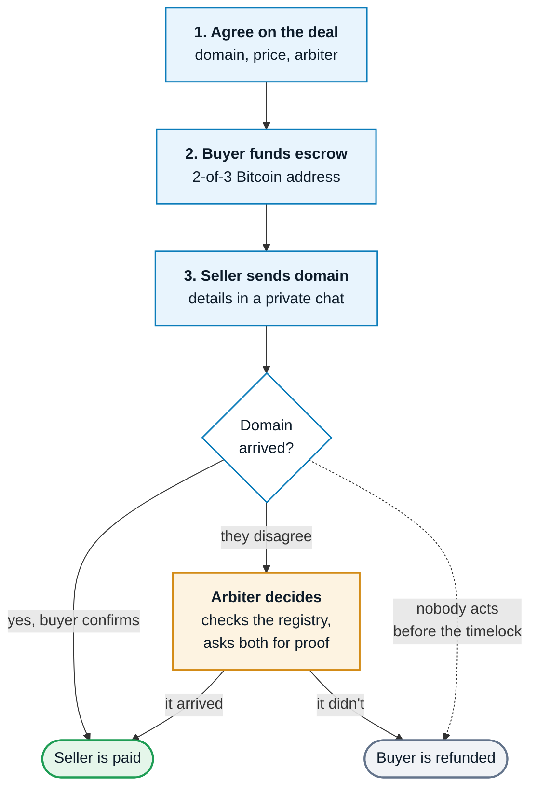
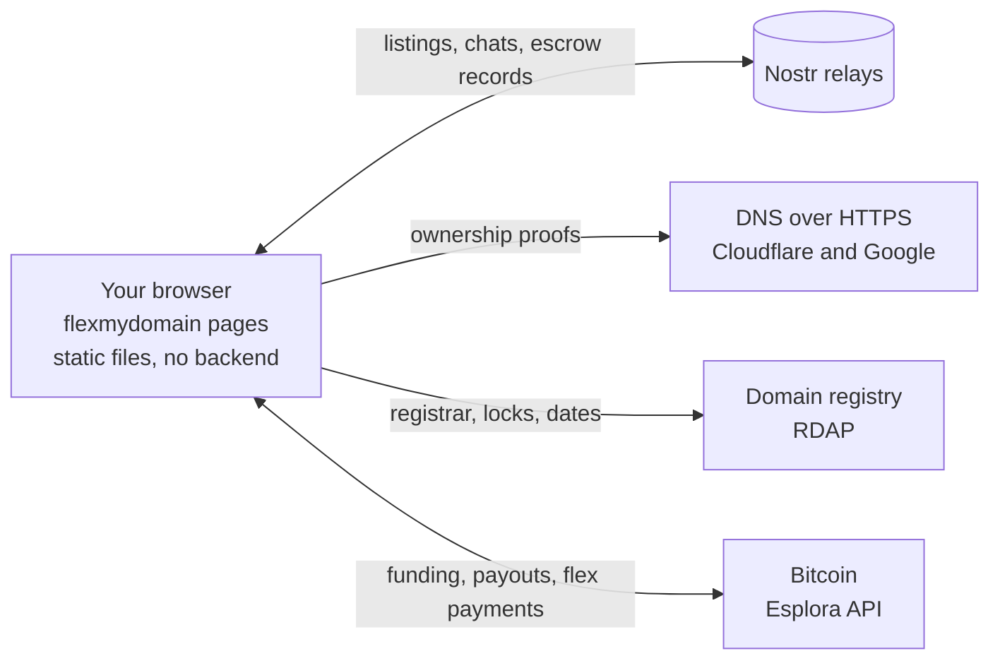

<p align="center">
  <a href="https://flexmydomain.com">
    
  </a>
</p>

<h3 align="center">Buy and sell domains on Nostr relays with 0% fees and no KYC</h3>

<p align="center">
  Listings live on Nostr, ownership is proved with a DNS record, and the money sits in a<br>
  Bitcoin escrow that no single party can move, including us. There are no accounts and no<br>
  commission, and the site has no backend.
</p>

<p align="center">
  <a href="https://flexmydomain.com"></a>
  <a href="https://youtu.be/wKE3GYcrY58"></a>
  <a href="spec/"></a>
</p>

<p align="center">
  
  
  
  
  
  
  <a href="LICENSE"></a>
</p>

<p align="center">
  <a href="https://youtu.be/wKE3GYcrY58">Watch the demo video</a> · <a href="https://flexmydomain.com">Open the live site</a>
</p>

## The problem

Selling a domain to a stranger is hard because neither side can trust the other.

- Marketplaces take 5 to 20% of the sale price, and escrow services charge on top. Many cheaper names are not worth listing at all.
- Someone has to go first. If the buyer pays first, the seller can keep the money. If the seller transfers first, the buyer can vanish. The usual fix is a middleman who holds the money while both sides wait.
- Most platforms let anyone list a domain they don't own, and buyers often find out only after paying.
- Listings, history and money sit in someone else's account system, which can change its fees, freeze a payout or shut down.

FlexMyDomain replaces the middleman with tools that already exist: DNS proves ownership, Nostr carries the listings and messages, and Bitcoin script holds the money in escrow.

Demo video: https://www.youtube.com/watch?v=wKE3GYcrY58

## Why use it over other marketplaces

- Affordable: a sale has no commission. You pay only the Bitcoin network fee, where traditional marketplaces take 5 to 20%.
- Decentralized: listings, messages and escrow records live on Nostr, with no central backend and no single point of failure.
- Free listings: anyone can list a domain they control on the marketplace, at no cost.
- Flex board: an optional one-time Bitcoin payment puts a domain on the home page leaderboard, and a bigger payment ranks it higher.

## Features

| Part | What it does |
|---|---|
| 🏆 **Rank board** | A public leaderboard of domains, ranked by sats paid this week or all time. Payments are on chain and matched to claims signed on Nostr, so anyone can recount it |
| 🛒 **Market** | Free listings as NIP-99 events. Each carries a DNS proof that every visitor's browser checks before showing it |
| 🛡️ **Spam free** | Only the real owner of a domain can list it. A listing needs a DNS record signed by the seller's key, and listings that fail the check are hidden |
| 🔐 **Escrow** | A 2-of-3 Taproot escrow for each trade, bound to its id: invite, fund, transfer, confirm. The only cost is the network fee, shown before you sign |
| 💬 **Private chats** | A NIP-17 chat for each pair of buyer, seller and arbiter, with cards for where to send the domain and the transfer code |
| ⚖️ **Arbiter desk** | Every escrow that names the arbiter, the domain's registry record, requests for read-only proof, and release or refund with a published ruling |
| 🛟 **Recovery** | A standalone page that takes the timelock refund with a saved recovery string, even with this site offline |
| 👤 **Portfolio** | Every domain a key has proven, on one page you can share |
| 🔑 **Accounts** | A Nostr extension, a key made and encrypted in the browser, or an nsec. Escrow keys are backed up, encrypted to your own Nostr key |
| 🧩 **Protocol** | Event kinds, builders and validators in `core/`, and the full spec in `spec/` |
| 📡 **Services** | Optional: a relay that accepts only valid flexmydomain events, an indexer, and a verifier that signs NIP-90 attestations |
| 🧪 **Tests** | 766 protocol vectors, and a regtest suite that spends every escrow path on Bitcoin Core |

Specs: NIP-01, 05, 07, 09, 11, 17, 19, 21, 31, 32, 39, 40, 42, 44, 45, 51, 57, 58, 59, 65, 78, 89, 90 and 99; BIP-21, 68, 340, 341, 342 and 350; DNS over HTTPS (RFC 8484) and RDAP (RFC 9083).

## What you can do

### List a domain for free

Add one TXT record that links the domain to your Nostr key. Before a listing is shown, each visitor's browser looks the record up through two independent DNS resolvers and checks its signature. A listing for a domain you don't control never appears.

### Sell it at 0% commission

1. The buyer pays into a 2-of-3 Taproot address held by the buyer, the seller and an arbiter. No single key can move the money.
2. In a private, encrypted chat, the buyer tells the seller where to send the domain: the registrar, the account and the email.
3. The seller transfers it the normal way, either as a push to the buyer's account or with an auth code for the buyer's registrar.
4. When the domain arrives, the buyer confirms, and that pays the seller straight away.

The only cost is the Bitcoin network fee, which the page shows before anything is signed.

### Settle disputes with evidence

If the two sides disagree, the arbiter reads the domain's public registry record (WHOIS/RDAP) and asks each side for read-only proof from their registrar, such as a read-only API key. Then it co-signs either the payout or the refund. The arbiter can't take the money or send it anywhere else, and every ruling is published with its reason.

### Get your money back if everyone disappears

A timelock lets the buyer take the refund alone, even with this site offline, using the recovery page and a saved recovery string.

### Flex your domain

The home page ranks domains by the sats paid for them. On the live site each payment is a signet transaction to one public address, matched to a claim the payer signed on Nostr, so anyone can recount the board from the chain and the relays. A site can take Lightning zaps instead, with receipts signed by the payment provider.

## How the escrow works



The money sits in a Bitcoin address that only moves when two of the three keys
sign, and each pair can do one job:

| Keys | What they can do |
|---|---|
| Buyer + seller | The normal payout, or a cancel that refunds the buyer |
| Seller + arbiter | Pay the seller when the arbiter rules for them |
| Buyer + arbiter | Refund the buyer when the arbiter rules for them |
| Buyer alone, after the timelock | Take the refund if everyone else has gone |

No key can move the money on its own before the timelock, the arbiter's
included.

## Built for real trades

The parts that guard money are tested against the systems they rely on.

- Every spending path runs against Bitcoin Core. The regtest suite funds real escrows and spends each path: cooperative release, arbiter release, arbiter refund and the timeout refund. A negative test checks that the arbiter key alone can't spend.
- Each address is bound to its escrow. The Taproot internal key commits to the escrow ID, so a signature for one trade can't spend another trade's coins, even when the same keys are reused.
- Each pair of buyer, seller and arbiter has its own NIP-17 chat. The arbiter never sees what the buyer and the seller say to each other, transfer codes included.
- Every page re-derives the escrow address from the public keys, re-checks DNS proofs, and applies the same published rules to the same public facts.
- The protocol, the arbiter's policy, the threat model and a guide to checking these claims yourself are in `spec/`.

There are 785 tests: 766 protocol vectors (`bun run test`) and a regtest suite that runs the escrow against a local Bitcoin node (`bun run test:regtest`).

> The escrow and the flex board run on Bitcoin signet (test coins) for now. The escrow moves to mainnet after an independent audit. The marketplace and the flex board are live today.

## How it's built

There is no application server. The pages are static files, and your browser
talks straight to public services:



A site that runs the flex board on Lightning also talks to its LNURL provider
for NIP-57 zaps.

## Beyond the hackathon

We built this during the hackathon, but we don't plan to stop here. The goal is a
domain marketplace on Nostr that people use with real money. These are the next
steps.

- Move the escrow to mainnet once an independent audit is done.
- Take the arbiter out of most trades. Nearly every dispute comes down to one
  question: did the domain reach the buyer? Software can answer that. The
  registry's RDAP record shows a move to another registrar, the buyer can
  publish a DNS proof under their own key once they control the zone, and a
  registrar's read-only API shows which account holds the domain. We want
  several independent oracles to run these checks and sign the result, and to
  settle trades as Discreet Log Contracts, where the oracles' signed answer is
  what unlocks the payout. The oracles never hold the money and never learn
  which trade they settled. A human arbiter would stay only as a fallback for
  what no API can see. Part of this exists already: `services/verifier`
  re-checks domain proofs from its own network and signs attestations that
  readers count against a threshold (`spec/PROTOCOL.md`, section 9).
- Use Lightning for small deals. On-chain escrow can't go much below 900 sats,
  because of the network fee and the dust limit. A Lightning hold invoice can
  lock a payment until a quick transfer, such as a push between two accounts
  at the same registrar, is confirmed. That would make even a 100-sat domain
  worth trading.
- Show each seller's track record. The protocol already defines signed trade
  receipts that each side writes about the other. Showing them, and counting
  only trades where the registry saw the domain move, lets a buyer check a
  seller's history before paying.

## Run it locally

You need [Bun](https://bun.sh) 1.3 or newer.

```bash
git clone https://github.com/Anshumancanrock/flexmydomain && cd flexmydomain
bun install
bun run build     # compile the pages
bun run serve     # http://localhost:8000
```

The local site is the same as the live one: it talks to the same public Nostr
relays and to Bitcoin signet, so the leaderboard and the listings match what you
see on [flexmydomain.com](https://flexmydomain.com). Press Ctrl+C to stop it.

To run the tests:

```bash
bun run test           # protocol vectors, no network needed
bun run typecheck
bun run test:regtest   # needs Bitcoin Core 31.1 in tools/
```

## Try it on the live site

These steps work on [flexmydomain.com](https://flexmydomain.com) or on your local copy.

1. Make an account. Click **Connect**, then create a key in the browser, log in
   with an nsec you already have, or use a Nostr extension such as Alby or nos2x.
2. Flex a domain. On the Rank page, type any domain, press **Flex it**, and pay
   the amount shown, or more, to the address shown. Signet coins are free from a
   [signet faucet](https://signetfaucet.com). The domain shows up on the board
   as soon as the payment reaches the mempool.
3. List a domain you own. On the Market, press **List a domain**, sign the
   proof, and add it as a TXT record at `_flexmydomain.<your domain>`. Press
   **Check DNS**, then **Publish to relays**. Listing is free.
4. Open an escrow. On the Escrow page, a buyer and a seller (two browsers or two
   keys) agree on the terms through an invite, and the buyer funds the address
   with signet coins.

## Act as the arbiter

Open the Escrow page, click **Connect**, then **Log in with your key**, and paste
the arbiter's nsec. Every escrow that names it shows up, ready to decide. To run
your own arbiter, put your npub in `arbiterPubkey` in `web/assets/config.js`.

## Project layout

```
core/      protocol: escrow script tree, settlements, Nostr events, DNS proofs, flex claims
net/       relays, DNS, RDAP, chain and Lightning clients
client/    browser bundle: signers, private messages, invoices
web/       the site: static pages and their TypeScript sources
services/  optional extras: a policy relay, an indexer, a proof verifier
spec/      protocol, arbiter policy, threat model, verification guide
test/      protocol vectors and Bitcoin Core regtest suites
```

## License

[MIT](LICENSE)
